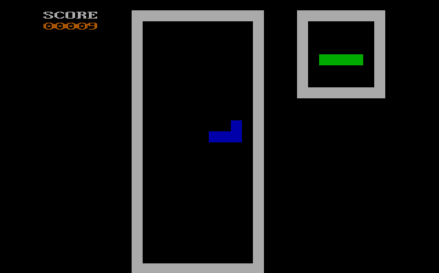
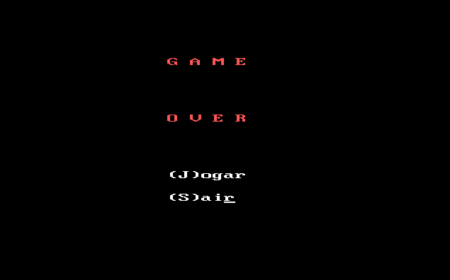

# Tetris Tasm

A Tetris Game done in Assembly for the x86 architecture. Work in Progress.

To be done:
- Make pieces rotate
- Add collision detection
- Make pieces fall directly when pressing arrow-down key

## Build and Run

This game is built with TASM. Click [here](https://mccshreyas.wordpress.com/2017/03/27/how-to-install-and-configure-tasm-on-windows-7810/) for a tutorial to run TASM on DosBox.  Then, place the _tetris.asm_ file in the folder where you can run TASM command and follow the procedure below.

```bash
tasm tetris.asm
# This will assemble the code into an obj file.

tlink tetris
# Takes the obj file created above and combines into an executable

tetris
# It will run the game
```

## Game Screens



